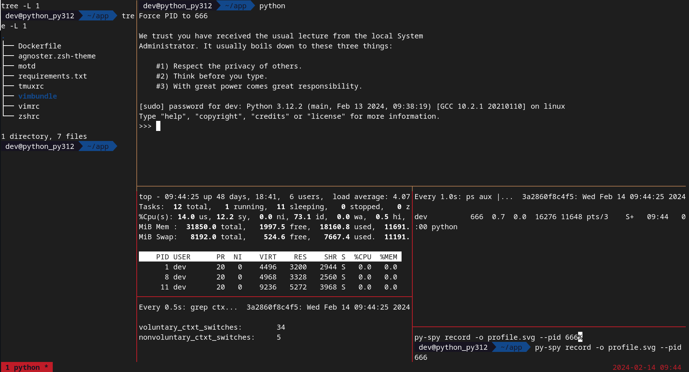

# machine
Your development environment embedded in a docker container

[]()
[]()

## Features
- vim
- oh-my-zsh
- preconfigured tmux (list mounted directory, show running process, perf tools ready to run)
- tox and python process automatically run with the PID set to `666` (not need to search your PID)
- regexploit ready to run
- valgrind, pysnooper, py-spy, scalene run out of the box

## Usages

Python:
```shell
$ cd python
$ docker build -t machine-python312 .
$ # run the main instance of the dev container with a default dashboard
$ NAME=$(basename $(pwd))_py312; docker run -it --rm --name $NAME -e CONTAINER_NAME=$NAME --privileged --mount type=bind,source="$(pwd)",target=/home/developer/app machine-python312 /bin/bash
$ # run an other shell into this same container
$ docker exec -it dev_python_py312 /bin/bash
$ # stop all the instances of this container
$ docker stop dev_python_py312
```

Running the `docker run` command give you the following dashboard (nested tmux on my local env):


